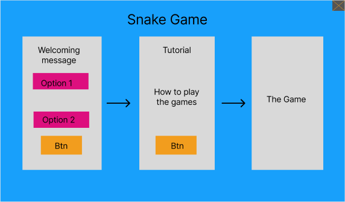

# Snack-Game-with-AI
Implementing a snake game with artificial intelligence using python language and it's libraries.

## Outcomes
We are looking after completing this project to learn and develop our technical skills as well as learning new topics and features in python language like artificial intelligence and build a project from scratch. Also we will work in this project as a team so we will be familiar with how companies work and overcoming the conflict that may occur between the teammates or conflict in the merge step.

## Group 04
1- Mohammad Alfayoume (TL)

2- Islam Alghoul

3- Lujain Aljarrah

4- Bayan Bushnaq

5- Alaa Abualadoos

6- Razan Alowedat

## Wireframes and Design 

The wireframe show us the GUI for snake game project.

There is a main GUI and it contains 3 GUI:

1- The first one it will appeare in front of the user to greeting him and make him choose one option for the game.

2- Once the user choose one option, it will lead him to another GUI. In the second one it will show the user the tutorial how he can play the games and it’s rule.

3- After the user know how to play the game, once he clicked on btn, it will lead him to finel GUI and it’s the game, so the user now can play

## User Stories

>### Title

1- Functionality

2- GUI

3- Difficulty

4- Music

5- Tutorial

>### Stories

1- As a user, I want to ensure that the functionality works well so that everything makes sense for me.

2- As a user, I want to see the GUI attractive so that I can be comfortable by seeing the colours and styling.

3- As a user, I want to see more than one level in the game so It will excite me and increase the challenge to win in the end.

4- As a user, I want to listen to quiet music while playing the game so it will make me more relaxed.

5- As a user, I want to see the tutorial for the game before playing so I can understand how I can play the game without struggling.

>### Feature tasks

1- Build the correct functionality for the game.

2- Make a beautiful GUI.

3- Make more than one option and level for the game.

4- Add relaxed music for the game.

5- Add a tutorial for each option of the game.

>### Acceptance tests

1- Make sure the functionality works well.

2- Ensure the GUI doesn’t harm the eyes or make the user let the game go.

3- Trying every level and option and ensuring the difference between them.

4- Testing the music.

5- Ensure the tutorial works well and it contains all the game details.
